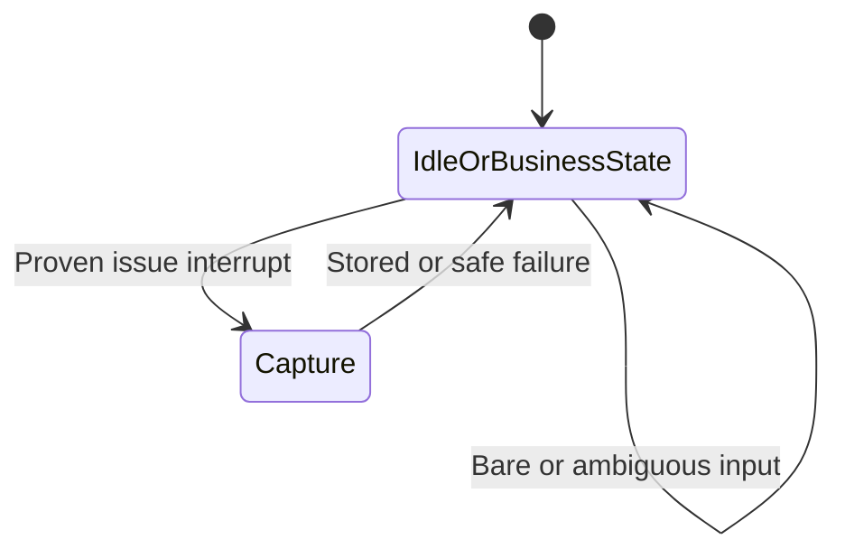

# Architecture Design Proof

Verdict: `needs_architecture_revision`

This proof follows
`docs/llm/Top_Level_Subflow_Architecture_Design_Proof_Contract.md`. It defines
target architecture only; none of the candidate owners or routes described as
“proposed” exist at runtime.

## 1. Task Identity And Product Need

| Field | Value |
|---|---|
| Task | `RUNTIME_ISSUE_INTAKE_AND_AUTOREPAIR_V1` |
| Business need | An administrator needs to record a small runtime problem immediately after observing it, preserving trusted context for later diagnosis without interrupting the business journey. |
| User-visible outcome | The bot stores one complete report, returns a truthful acknowledgement, and leaves the current FSM state and business data unchanged. A later daily process returns a truthful classification/result. |
| Current Product Truth | Unsupported. No action, command, route, store, maintenance process, or result outbox exists. |
| Target Product Truth | Planned admin-only `report_runtime_issue` intake plus a separately gated daily diagnostic process; safe autorepair remains disabled until the public policy contradiction is resolved. |
| Risk | High for the complete feature because it crosses top-level routing, active FSM, persisted diagnostic data, code changes, and production operations. Intake alone is medium risk. |
| Date / architect | 2026-07-28 / documentation architecture audit |

The problem is not “let the bot edit itself.” It is lossless, low-friction
capture of an administrator observation with enough trusted correlation
metadata for a later bounded process to distinguish a defect from expected
behavior, missing evidence, an external failure, or a feature request.

## 2. Architecture Classification

Primary class: **1. new top-level business intent**.

`report_runtime_issue` owns a distinct administrator operation: create a
diagnostic issue record. It is not an extension of invoice, analytics,
customization, archive, contact, or work-time behavior because it does not
operate on those business objects. It is not a slot or internal strategy
because the user explicitly requests a separately persisted diagnostic record
and acknowledgement. It is not an in-FSM sub-action because it must be
available across otherwise unrelated active FSMs without becoming owned by
them. It is not Product Truth/InfoHelp because it performs a bounded write.
It is not merely reserved capability because the target is a public executable
admin action after implementation.

The daily diagnosis/autorepair process is not a second conversational top-level
action. It is a proposed internal maintenance workflow over persisted issues.

Evidence: `docs/llm/Canonical_Action_Registry.md` has no equivalent action;
`bot/handlers/invoice.py::process_invoice_text` owns idle business routing;
`bot/services/active_fsm_guard.py` owns cross-FSM global controls; current
customization requests in `bot/handlers/access_admin.py` represent product
change requests, not observed runtime incidents.

## 3. Canonical Action Contract

| Field | Contract |
|---|---|
| Canonical token | `report_runtime_issue` |
| Current status | `planned` |
| Meaning | Persist one administrator observation and trusted runtime correlation snapshot for later diagnosis. |
| Proposed runtime owner | One Python entry owner, `handle_runtime_issue_capture`, backed by proposed `RuntimeIssueService`. Names are design labels, not existing symbols. |
| Allowed contexts | Authorized administrator; idle or active FSM; text command, bounded natural text, or voice transcript. |
| Entry modes | Official `/issue <description>`; bounded text/voice semantic intent. No V1 button. |
| Immediate effects | At most one idempotent SQLite issue record and one acknowledgement send. |
| Forbidden meaning | Feedback, feature approval, production-change permission, invoice mutation, analytics query, replay of the reported action, or a repair request. |

The token must remain `planned` in any future registry change until its Python
owner, routes, persistence, authorization, tests, and Product Truth copy exist.

## 4. Semantic Boundary Matrix

| Exact user meaning/input | Expected action/status | Why | Must not become |
|---|---|---|---|
| `/issue Po stlačení Uhradená...` | `report_runtime_issue` | Explicit official command plus complete observation. | Mark-paid callback, customization, repair permission. |
| “Chyba: po potvrdení sa nezobrazila správa.” from admin | `report_runtime_issue` only when the bounded resolver is confident | Explicit observation of runtime behavior. | Broad keyword whitelist or invoice action. |
| Voice equivalent from admin | `report_runtime_issue` after STT, admin guard, and bounded resolution | Same business intent and owner as text. | Voice-only persistence path. |
| `/issue` | Usage response; no action record | Required description missing; V1 has no intake FSM. | Capture-next-message state. |
| “Can you report problems?” | Product Truth/InfoHelp response | Capability question is informational. | Issue write. |
| “Please add recurring invoices.” | Customization/feature-request route or `unknown` | Desired new capability, not observed defect. | Confirmed defect or implicit repair approval. |
| “Which invoices are unpaid?” | Existing analytics action | Read-only business question. | Runtime issue. |
| “Mark this invoice paid.” | Existing invoice action/callback contract | Business mutation. | Runtime issue, even if “issue” appears in surrounding text. |
| “The provider is down.” | Issue intake if explicitly reported; later classification remains unproven | Reporter language is observation only. | Automatic `external_failure` classification. |
| Ordinary in-FSM customer/contact text | Current state owner | Slot content belongs to active flow. | Issue because it contains “bug/chyba” incidentally. |
| Ambiguous normal business text | Existing action or `unknown` | Issue intent is not sufficiently proven. | Write default. |

Bounded issue meaning:

```text
meaning:
  The administrator explicitly asks to record a concrete observed runtime
  problem in this bot.
positive_examples:
  "/issue Po stlačení tlačidla sa potvrdenie nezobrazilo."
  "Chyba: po úspešnom uložení zostala klávesnica."
not_this:
  capability questions, feature requests, generic dissatisfaction, business
  actions, analytics, or permission to repair/deploy.
```

The resolver receives only Python-approved action candidates. Low confidence,
conflicting action evidence, or missing concrete observation resolves to the
existing clarification/`unknown` behavior and performs no issue write. Python
keeps deterministic parsing only for the exact `/issue` prefix and its
remainder; it must not accumulate a multilingual phrase dictionary.

## 5. Structured Slot Contract

| Slot | Type/allowed values | Source | Required | Default owner | Invalid behavior | Voice/precision boundary |
|---|---|---|---|---|---|---|
| `description` | Sanitized UTF-8 observation; proposed 10–2000 chars | Command remainder, original resolved text, or STT transcript | Yes | None | Usage/no write when missing; safe error/no write when invalid | Preserve original meaning; never let a summary replace it; redact secrets before persistence according to approved policy. |
| `short_title` | String, maximum 120 chars | Deterministically derived from sanitized description | Yes | Python service | Fall back to bounded leading text; never reject a valid report solely for title derivation | No separate LLM title generation in V1. |
| `reported_at` | UTC timestamp | Trusted runtime clock | Yes | Python service | Persistence fails closed | Never extracted from voice/text. |
| `occurred_at` | Optional UTC timestamp plus precision marker | Bounded extractor only when explicitly stated | No | `null` / `unknown` | Invalid or ambiguous becomes null; no clarification FSM | Must not guess date, timezone, or exact time. |
| `actor_telegram_id` | Integer | Trusted Telegram message/update context | Yes | None | Fail closed | Never user-overridable. |
| `workspace_id` | Trusted workspace identifier or null-with-reason | `workspace_context.resolve_for_user_readonly` | Conditionally required when one active workspace is unambiguous | Null pending approved policy | Fail closed on cross-workspace value; do not select from text | Voice/text cannot specify it. |
| `source_channel` | `text` or `voice` | Python route | Yes | None | Fail closed | STT output does not choose the enum. |
| `active_fsm_state` | Bounded state name or null | Trusted `FSMContext` snapshot | Yes | `null` when idle | Safe bounded placeholder if unreadable; intake failure policy must be explicit | Never accepted from report content. |
| `active_fsm_context_summary` | Versioned allowlist map, size-bounded | Trusted snapshot and Python sanitizer | Yes | Empty map | Omit disallowed fields; never persist raw FSM data | Exclude tokens, raw files, full messages, secrets, amounts unless explicitly approved diagnostic fields. |
| `reported_build_sha` | 40-hex SHA or null-with-source status | Trusted deployed-build source | No at intake; mandatory for autorepair eligibility | `null/unavailable` | Store unavailable status; later repair gate stops | Never accept spoken/typed SHA. Current owner does not exist. |
| `telegram_update_id` | Integer | Trusted update context | Yes | None | Fail closed if no stable delivery identity exists | Not extracted. |
| `telegram_message_id` | Integer | Trusted message context | Yes | None | Fail closed if unavailable | Not extracted. |
| `telegram_chat_id` | Integer | Trusted message context | Yes | None | Fail closed | Not extracted. |
| `privacy_metadata` | Version, redaction flags, detected-sensitive categories, truncation flags | Python sanitizer | Yes | Current policy version | Fail closed if required sanitization cannot complete | No raw secret values in metadata. |
| `deduplication_key` | Stable hash/unique string | Python from trusted actor/chat/update/message/source fields | Yes | None | Fail closed | Description alone is not the key. |

Bounded LLM responsibility is limited to the canonical issue-intent decision and
optional explicit `occurred_at` extraction under a Python schema. Python owns
authorization, command parsing, trusted context, derivation, validation,
sanitization, idempotency, persistence, and response. Missing description
never enters clarification state; bare `/issue` ends immediately with usage.
There are no file-only fields or file intake in V1.

Unresolved public design inputs: final length/retention limits; redaction
version; null-workspace policy; whether `occurred_at` should be omitted from V1
rather than remain optional.

## 6. Public Route And Convergence Map

| Entry mode | Public entry | Guards | Resolver/helper | Shared Python owner | Result |
|---|---|---|---|---|---|
| Command | `/issue <description>` | Outer user authorization; explicit admin check; active-FSM snapshot | Deterministic exact prefix and remainder | Proposed `handle_runtime_issue_capture` | Idempotent record + acknowledgement; no FSM mutation |
| Text | Explicit bounded admin wording | Outer authorization; admin check before issue resolver; active-FSM guard | Existing semantic resolver pattern with Python-provided candidates | Same owner | Same record/response |
| Voice | Admin voice observation | Outer general authorization before STT; after STT admin check before issue-intent resolver/persistence; active-FSM guard | STT then same bounded resolver | Same owner | Same slots/persistence/response |
| Button | None in V1 | N/A | N/A | N/A | No callback token or keyboard |

Idle command routing may have a thin handler, but it must not own persistence.
Idle semantic text and voice converge through the same canonical action owner.
During an active FSM, the shared guard must intercept only a proven issue
intent and return as handled before state-specific dispatch. Capability
questions continue to Product Truth/InfoHelp and never execute the action.

Current limitation: for an authorized non-admin voice user, semantic admin
intent is unknowable before STT. The current general authorization boundary
still precedes STT; the admin action check must precede issue resolution,
persistence, and log access after STT. A stricter policy requires an explicit
admin-only voice entry signal and product approval.

## 7. FSM Graph And State Ownership

There is no issue-intake FSM in V1.



`IdleOrBusinessState` means the exact pre-event state, including null/idle.
The return arrow is identity, not suspend/restore.

| State | Entry condition | Accepted input | Unknown behavior | Side effects allowed | Success/parent state | Back/cancel | Stale behavior |
|---|---|---|---|---|---|---|---|
| Existing idle/business state | Before issue message | Existing owner’s inputs plus narrow global issue interrupt | Existing owner or `unknown`; no issue write | Existing journey only when not issue capture | Existing contract | Existing controls | Existing guard |
| Ephemeral capture call, not an FSM state | Proven admin issue action with complete description | One current message/transcript only | Safe no-write response | Issue persistence and acknowledgement only | Exact pre-event state/data | Not applicable | Snapshot failure follows safe no-write policy |

Required invariant:

> FSM state and business FSM data after issue capture equal the state and data
> before issue capture.

The future route must not call `state.clear`, `state.set_state`,
`state.update_data`, stale-state clear-and-idle routing, suspend/restore, replay,
or the current post-handler activity stamp. It must capture a sanitized
read-only snapshot and return handled before state-specific dispatch.
Persistence failure, duplicate delivery, and acknowledgement failure also leave
the FSM untouched.

Bare `/issue` sends usage immediately and does not arm the next message.
There is no clarification, cancel, back, keyboard, or pending context.
Fresh unrelated top-level switching remains unsupported except for this
explicit, non-mutating global interrupt.

Evidence and gap:
`bot/services/active_fsm_guard.py::ActiveFsmMessageMiddleware` and
`handle_active_fsm_text_update` are the only safe shared location; current
`test_active_text_pass_through_is_not_swallowed_and_stamps_after_handler`
proves the existing activity stamp, so new preservation tests must prove the
issue branch bypasses it. `PROJECT_LOG.md` 2026-07-09 records the broader
switching gap.

## 8. Decision And Callback Contract

Issue intake has no confirmation, DecisionResolver family, pending state,
button token, nonce, or callback in V1. The administrator’s complete message is
the report, not authorization to repair.

- Text and command: one-shot capture only after authorization and validation.
- Voice: same capture after STT and bounded resolution.
- Wrong state: state does not block a proven global issue interrupt and is not
  modified.
- Duplicate Telegram update: return the existing issue identifier and do not
  insert a second row.
- Stale/legacy callbacks: no issue callback exists; existing callback owners
  continue to reject/ack according to their contracts.
- Ambiguity, missing description, missing trusted identity, unauthorized input,
  or cross-workspace context fails closed before persistence.

The daily maintenance classification is not a conversational confirmation and
does not derive repair permission from the issue text.

## 9. Side-Effect And Ownership Map

| Side effect | Trigger | Python owner | Validation/confirmation before effect | Failure/rollback | Idempotency |
|---|---|---|---|---|---|
| Insert issue record | Authorized, complete canonical action | Proposed `RuntimeIssueService` transaction | Admin, schema, redaction, trusted context, workspace, dedup key | Transaction rollback; truthful failure response; FSM unchanged | Unique dedup key returns existing issue |
| Send intake acknowledgement | Successful insert or recognized duplicate | Bot handler through existing bot send owner | Persisted issue ID known | No false “stored” claim; delivery failure does not duplicate issue | Response keyed to update/issue |
| Read FSM snapshot | Before insert | Shared Python guard/sanitizer | Allowlist and size bound | Omit unsafe context or fail according to approved required-field policy | Read only |
| STT call | Authorized voice | Existing voice owner | Outer general authorization | Existing safe voice error | Existing update handling |
| Future issue claim | Eligible issue | Proposed maintenance service/CLI | Clean run identity; atomic status/lease check | Transaction rollback/lease expiry | Claim token and compare-and-set |
| Future manifest generation | Successful claim | Proposed maintenance service/CLI | Claimed rows only; redaction; digest | Regenerate from SQLite | Run/claim/digest keyed |
| Future result record | Valid claimed issue | Proposed service/CLI | Claim token, schema, allowed transition, evidence digest | Reject invalid/stale writes | Result version |
| Future notification enqueue | Terminal truthful result | Proposed bot-owned outbox service | Authorized recipient from trusted issue context | Retry without changing result truth | Issue/result/recipient key |

Forbidden during intake: invoice mutation, callback execution/replay, file
upload, email, business edit/delete, workspace switch, code repair, GitHub
operation, deployment, or any FSM/pending/activity mutation.

Future code, Git, test, merge, deploy, and rollback operations are governed by
the policy/runbook, not by the issue action. Current human approval prohibits
unattended merge/deploy.

## 10. Authorization, Tenant, And Precision Boundaries

- `TelegramUserAuthorizationMiddleware` remains the outer general guard before
  handlers, STT, LLM, temp files, and business persistence for unauthorized
  users.
- The action performs `is_admin_telegram_user` before command persistence or
  natural-text issue resolution. For voice it performs that admin check
  immediately after STT under the current limitation described in section 6.
- `actor_telegram_id`, Telegram identifiers, workspace, FSM snapshot, build
  SHA, authorization, repair permission, and deploy permission are trusted
  Python context only.
- `workspace_id` comes only from read-only workspace resolution and membership
  enforcement. A report can never choose or override another tenant.
- Every issue lookup, claim, result, and notification uses the stored trusted
  workspace/actor scope plus service authorization; maintenance manifests never
  broaden it.
- Voice cannot supply workspace, actor, update IDs, SHA, FSM state, exact money,
  repair authority, deploy authority, secrets, or credential values.
- Intake has no destructive or sensitive business effect and no confirmation.
  Repair and deployment have separate evidence and human gates.
- Unauthorized and cross-tenant attempts create no row, manifest, evidence
  lookup, or result notification and reveal no tenant data.

Evidence: `bot/services/authorization.py`,
`bot/services/workspace_context.py`,
`tests/test_tenant_safety.py`, and `tests/test_workspace_context.py`.

## 11. User-Facing Response And Exit Contract

Final copy requires product approval and follows the current Slovak language
policy.

| Outcome | Response purpose/example | Keyboard | Next valid action | Resulting state/destination |
|---|---|---|---|---|
| Stored | `Problém som uložil ako IR-…. Aktuálna akcia bota zostala nezmenená.` | No new keyboard; preserve existing message keyboard state | Continue existing journey or any idle action | Exact pre-event FSM |
| Duplicate update | Same truthful issue ID; no claim of a second record | Unchanged | Same | Exact pre-event FSM |
| Bare command | `Opíšte problém v tej istej správe: /issue po stlačení ...` and `Aktuálnu akciu bota som nezrušil.` | Unchanged | Resend a complete `/issue ...` or continue business flow | Exact pre-event FSM; no pending intake |
| Invalid/too sensitive | Safe request to resubmit a bounded description; no “stored” claim | Unchanged | Complete new report | Exact pre-event FSM |
| Persistence failure | `Problém sa nepodarilo uložiť. Skúste to neskôr.` | Unchanged | Retry complete message | Exact pre-event FSM |
| Unauthorized | Existing fail-closed authorization response/policy | None from issue action | Existing access path | No issue/FSM effect |
| Ambiguous normal text | Existing current route or `unknown` response | Existing owner | Existing action/clarification | Existing owner’s state |
| Later result | Truthful category, changed/not-changed statement, and exact SHA/smoke/rollback facts only when proven | No action keyboard in V1 | Review or file a separate approved task | No business FSM mutation |

The Ukrainian prompt samples are intent examples, not current repository
language evidence. If multilingual administrator copy is desired, the product
owner must approve an exception before Product Truth changes.

## 12. Product Truth And InfoHelp Contract

| Field | Target |
|---|---|
| Capability ID | Proposed `runtime_issue_intake` |
| Status after implementation | `implemented` only after public routes, service, tests, and copy are proven |
| Supported behavior | Admin records one complete observation by `/issue`; supported bounded text/voice may converge; active business state remains unchanged. |
| Limitations | Admin only; one message; no files/buttons/intake FSM; storage is not a repair promise; optional context can be unavailable/redacted. |
| Setup | Approved SQLite migration/service and trusted runtime context; no user-provided workspace/SHA. |
| Forbidden claims | Guaranteed fix; confirmed bug at intake; automatic deployment; provider cause without evidence; exact SHA/deploy/smoke/rollback without proof. |
| Safe next step | Send a complete `/issue ...`; await a later truthful result. |
| “Can you do this?” | Current: no—this is planned, not implemented. Target: an admin can record an issue; repair is conditional and separately governed. |
| “How do I use this?” | Target: send `/issue` and the complete observation in the same message. |

A proposed secondary capability ID, `runtime_issue_autorepair`, remains
`planned` and unavailable until policy authority and real operations are
proven. Information questions never execute either capability. This package
does not modify the registries, Product Truth, or InfoHelp.

## 13. Negative-Space And Regression Contract

The change must not steal or alter:

- invoice creation/edit/send/pay/cancel/analytics actions;
- accounting document, receipt, contact, archive, work-time, access, and
  customization routes;
- ordinary active-FSM slot input or established `/cancel`, `/menu`, `/start`;
- stale-state clear-and-idle recovery;
- read-only analytics versus write/sensitive actions;
- outgoing invoices versus external accounting documents;
- draft versus persisted invoice behavior;
- Product Truth/InfoHelp questions versus execution;
- current voice precision and typed/file-only exclusions;
- callback acknowledgement, state/context/expiry, duplicate, legacy, and
  stale-payload behavior;
- unauthorized-before-business and workspace-isolation guarantees;
- current canonical contact matching or analytics semantics;
- production human-review gates.

The word “issue,” “bug,” or “error” alone is insufficient. Feature requests and
generic feedback are not confirmed defects. An issue report never replays the
reported callback or changes the object it describes. No report content may
select a workspace, actor, build, state, or permission.

Adjacent regression owners are the suites listed in
`00_REPOSITORY_AUDIT.md`, especially active FSM, voice state routing, state
control, access, tenant safety, decision callbacks, invoice follow-up,
customization admin, archive job/worker, contacts, and analytics.

## 14. Acceptance Scenario Contract

The exact detailed scenarios are in `05_ACCEPTANCE_SCENARIOS.md` and are
normative for future implementation. Required public Conversation Acceptance
Proof uses the real canonical section in
`docs/Evaluation_and_Smoke_Test_Standards.md`.

Minimum proof set:

1. idle command, natural text, and voice convergence;
2. active-FSM text/voice capture with exact state/data/activity preservation;
3. bare command with no pending state or next-message capture;
4. unauthorized text and voice with no issue row;
5. ambiguous business text and capability questions with no issue row;
6. persistence failure and duplicate delivery;
7. workspace isolation and secret redaction;
8. unchanged callback/FSM/business journeys;
9. claim lease, expiry, and interrupted-run recovery;
10. every classification, allowed repair, forbidden stop, failed test gate,
    failed smoke/rollback, and truthful notification category;
11. the paid-invoice callback and contact-resolver/analytics motivating cases.

For the public action, expected slots are those in section 5; the state
sequence is pre-state → ephemeral capture → identical pre-state; the only
allowed effect is one idempotent issue row plus acknowledgement. There is no
button convergence, clarification continuation, cancel/back, or issue pending
state because these are intentionally excluded.

## 15. Out Of Scope And Known Architecture Gaps

- Runtime implementation, tests, migrations, server/deployment actions,
  credentials, and infrastructure.
- Intake files, screenshots, forwarded messages, buttons, multi-message
  clarification, issue edit/delete, broad language learning, or report
  priority/severity chosen by the reporter.
- Automatic top-level switching other than the narrow non-mutating interrupt.
- Automatic repair of schema, architecture, authorization, workspace,
  accounting truth, secrets, infrastructure, dependency, destructive, or other
  forbidden scopes.
- A global autorepair agent contract or implementation handoff.
- Private operational details in the public repository.

Known public gaps/decisions:

1. Current contracts require human approval before merge/deploy, conflicting
   with the proposed unattended repair outcome.
2. Final Slovak versus multilingual administrator copy is unapproved.
3. Null-workspace, retention, size, redaction, and optional `occurred_at`
   policies are unresolved.
4. Exact activity-metadata preservation needs an approved interpretation and
   future proof.
5. The authorized-non-admin voice-before-STT limitation needs acceptance or a
   different explicit voice entry signal.
6. Trusted build-SHA, structured evidence, result CLI, and generic
   notification outbox owners are target designs, not current owners.

Private operations inputs are deliberately deferred and do not themselves
block public architecture approval. **Private operational evidence required
before implementation/deployment.**

## 16. Evidence Index And Verdict

### Contracts and registries

- `AGENTS.md`, source-of-truth, preflight, human-approval, and agent-change
  rules.
- `docs/llm/Top_Level_Subflow_Architecture_Design_Proof_Contract.md`, all
  required proof sections and verdict vocabulary.
- `docs/llm/New_Action_Design_Checklist.md`, new-action and handoff gates.
- `docs/llm/FakturaBot_LLM_Orchestrator_Contract.md`, bounded orchestration and
  Python side-effect ownership.
- `docs/Canonical_Decision_Resolver_Contract.md`, bounded decision semantics.
- `docs/llm/Canonical_Action_Registry.md` and
  `docs/llm/In_Action_Response_Registry.md`, current action/response truth and
  absence of this token.
- `docs/Product_Truth_Layer.md` and
  `docs/Info_Help_Guidance_Layer.md`, truthful capability claims.
- `docs/Evaluation_and_Smoke_Test_Standards.md`, real canonical Conversation
  Acceptance Proof section and non-approval meaning of `safe_to_commit`.
- `docs/Code_Agent_Handoff_Contract.md`, agent output and human approval gates.
- `docs/Implementation_Agent_Checklist.md`, implementation preflight.
- `docs/Product_Doctrine_2030.md`, bounded AI, deterministic execution, Product
  Truth honesty, state-aware explanation, and human approval for code-agent
  handoff.

The original prompt’s
`docs/llm/Conversation_Acceptance_Proof_Contract.md` is absent. No evidence is
attributed to it; the real current owner is the section in
`docs/Evaluation_and_Smoke_Test_Standards.md`.

The prompt path `docs/FakturaBot_LLM_Orchestrator_Contract.md` is also absent.
The real current document read and cited by this proof is
`docs/llm/FakturaBot_LLM_Orchestrator_Contract.md`.

### Code and tests

All code owners and exact adjacent test files are indexed in
`00_REPOSITORY_AUDIT.md`. Material symbols include:

- `bot/services/authorization.py::TelegramUserAuthorizationMiddleware`,
  `is_admin_telegram_user`;
- `bot/handlers/invoice.py::process_invoice_text`;
- `bot/services/semantic_action_resolver.py`;
- `bot/services/active_fsm_guard.py::ActiveFsmMessageMiddleware`,
  `handle_active_fsm_text_update`, `touch_active_fsm_activity`;
- `bot/handlers/voice.py`;
- `bot/services/workspace_context.py`;
- `bot/services/db.py`;
- `bot/services/archive_job_service.py::claim_next_runnable_job`;
- `bot/services/archive_worker.py`;
- `bot/handlers/decision_callbacks.py`;
- `bot/handlers/invoice_followup.py`;
- `bot/services/customization_requests.py`;
- `bot/services/contact_service.py::resolve_contact_lookup` and workspace
  counterpart;
- invoice analytics dataset and planner services.

### Project and operations evidence

Relevant `PROJECT_LOG.md` entries are the 2026-07-18 deployments, 2026-07-17
contact/Conversation Acceptance Proof work, 2026-07-16 archive enqueue repair,
2026-07-11–13 workspace migration gates, 2026-07-09 active-FSM guard,
2026-06-15/16 follow-up scheduler and callback cleanup, 2026-05-30 archive
claim/lease, and 2026-04-10 structured debug entry.

Tracked operations evidence is in `scripts/update_repo.sh`,
`scripts/deploy_owner_run.sh`, `docker-compose.prod.yml`, and the public
runbooks named in the audit. Private server/runbook material is intentionally
not required in the public tree and is not an architecture blocker.

### Verdict

`needs_architecture_revision`

Reason: the public target of unattended repair merge/deploy is inconsistent
with current public human-approval contracts, and the product decisions listed
in section 15 are not approved. The repository has enough evidence to define
the architecture; this is not `blocked_by_missing_evidence`. Absent private
commands, server paths, and credentials do not cause the verdict and are
required only before implementation/deployment as applicable.

No implementation prompt or runtime handoff may be written from this verdict.
